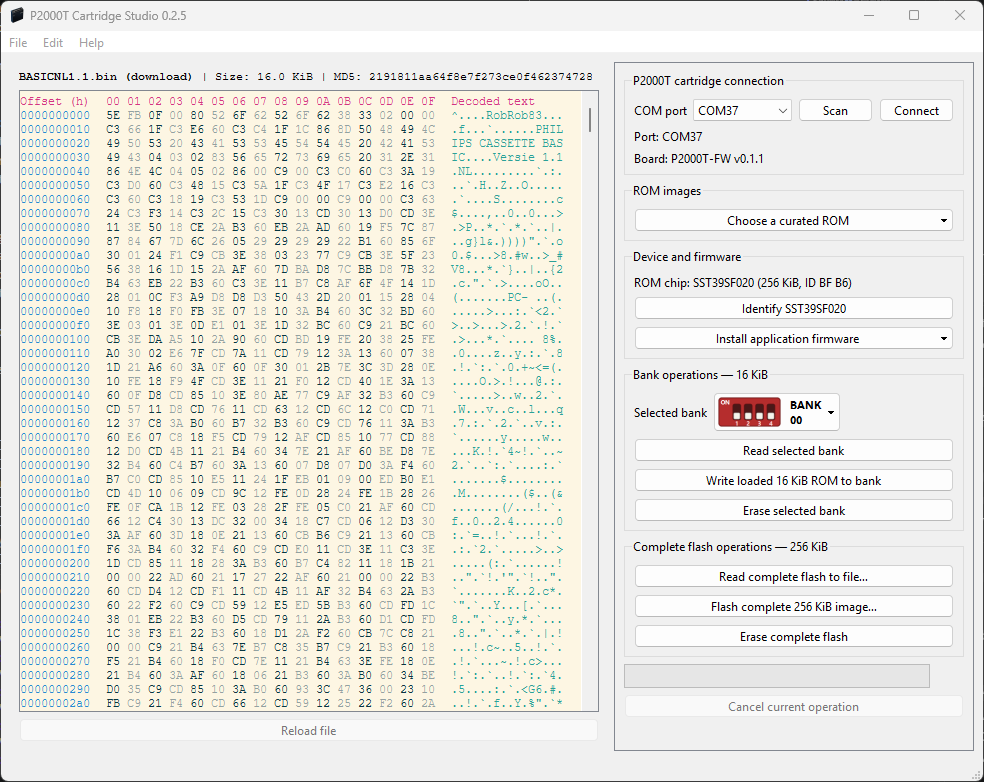

# P2000T Cartridge Studio

[](https://github.com/ifilot/p2000t-cartridge-studio/actions/workflows/build.yml)
[](https://github.com/ifilot/p2000t-cartridge-studio/tags)
[](LICENSE)

P2000T Cartridge Studio is a Windows application for putting ROM software onto
a **USB-programmable cartridge for the Philips P2000T and P2000M**. Choose a
bundled ROM or open your own ROM file, copy it to the cartridge over USB, then
use the cartridge in your computer. No programming or build tools are needed
to use the Windows download.

[](images/screenshot.png)

*Studio with a BASIC ROM loaded. The controls on the right let you connect the
cartridge, choose a ROM and write it to a bank. Click the screenshot to view it
at full size.*

The cartridge holds **16 banks**: numbered storage slots, each containing one
16 KiB ROM image. Its front DIP switches select which bank your P2000T or
P2000M uses. Studio can also back up the cartridge, replace all banks at once,
and update the cartridge's firmware (the software that handles its USB connection).

This application is designed for the
[ATmega32U4 cartridge with front DIP switches](https://github.com/ifilot/p2000t-cartridges/tree/master/multicartridge-smd-32u4-front-dipswitch),
using an SST39SF020 memory chip. See that hardware project for the circuit
board, schematic, fabrication and enclosure files.

## Table of contents

- [Getting started](#getting-started)
- [Using the cartridge in your P2000T or P2000M](#using-the-cartridge-in-your-p2000t-or-p2000m)
- [Backing up and replacing ROMs](#backing-up-and-replacing-roms)
- [Updating cartridge firmware](#updating-cartridge-firmware)
- [Help with common problems](#help-with-common-problems)
- [Downloads](#downloads)
- [Repository layout](#repository-layout)
- [Build the firmware under WSL](#build-the-firmware-under-wsl)
- [Build the Windows preparation utility](#build-the-windows-preparation-utility)
- [Build the Windows application and installer](#build-the-windows-application-and-installer)
- [Continuous integration and releases](#continuous-integration-and-releases)
- [Licence](#licence)

## Getting started

You need a Windows PC, a USB data cable, and a cartridge with its firmware
already installed. If you have just assembled a cartridge, first follow the
[initial preparation instructions](tools/bootloader-installer/README.md#use).
That one-time step requires a USBasp programmer; everyday use only needs USB.

**Always remove the cartridge from the P2000T or P2000M before connecting it
to USB.** Turn off the computer before removing or inserting the cartridge.
Keep the cartridge outside the computer while reading, writing or updating it.

1. Download and run the
   [Windows installer](https://github.com/ifilot/p2000t-cartridge-studio/releases/latest/download/p2000t-cartridge-studio-windows-x64-setup.exe).
   If you prefer the
   [portable ZIP](https://github.com/ifilot/p2000t-cartridge-studio/releases/latest/download/p2000t-cartridge-studio-windows-x64.zip),
   extract the entire archive and run `p2000t-cartridge-studio.exe` from that folder.
2. Connect the cartridge to your PC with the USB data cable and open Studio.
3. Click **Scan**, select the cartridge's **COM port** (its Windows USB serial
   connection), then click **Connect**.
4. Under **Device and firmware**, click **Identify SST39SF020** and check that
   Studio identifies the ROM chip as **SST39SF020**. You must identify the chip
   before you can flash ROMs to the cartridge.
5. To keep any existing ROMs, click **Read complete flash to file…** and save a
   backup before making changes.
6. Click **Choose a curated ROM** and choose a ROM for your computer, or use
   **File → Open** to load your own 16 KiB ROM file. The bundled collection
   includes Philips Disk BASIC 24K, MCPM, and UCSD Pascal P2000M images.
7. Under **Bank operations — 16 KiB**, choose the destination using
   **Selected bank**. Note its bank number and the displayed DIP switch pattern.
8. Click **Write loaded 16 KiB ROM to bank** and confirm. This replaces the
   selected bank's contents. Wait until writing and read-back verification
   have finished before disconnecting USB.

## Using the cartridge in your P2000T or P2000M

1. Disconnect the cartridge's USB cable and turn off your P2000T or P2000M.
2. Set the cartridge's four front DIP switches to the pattern shown in Studio
   for the bank you programmed. Use the switch numbers and the **ON** marking
   on the physical switch block to orient the pattern.
3. Insert the cartridge into **SLOT1**, then turn on the computer to use the
   selected ROM. Follow that ROM's own instructions for any additional disks
   or peripherals it needs.

Selecting a bank in Studio chooses where USB operations read or write; it does
not move the cartridge's physical switches. To use another bank, turn off the
computer, change the DIP switches, and turn it on again. The ROMs stay on the
cartridge when power is disconnected.

## Backing up and replacing ROMs

Connect the cartridge to your PC and identify its chip as described in
[Getting started](#getting-started).
A *ROM image* is a file containing the software stored on the cartridge.

| What you want to do | Control in Studio | What it affects |
| --- | --- | --- |
| Back up the whole cartridge | **Read complete flash to file…** | Saves all 16 banks to one 256 KiB file. |
| Save one bank | **Read selected bank**, then **File → Save** | Saves the selected bank as a 16 KiB file. |
| Replace one bank | **Write loaded 16 KiB ROM to bank** | Erases, writes and verifies only the selected bank. |
| Restore or replace the whole cartridge | **Flash complete 256 KiB image…** | Erases and replaces all 16 banks, then verifies the result. |
| Clear one bank | **Erase selected bank** | Erases only the selected bank. |
| Clear the whole cartridge | **Erase complete flash** | Erases all 16 banks. |

**Writing or erasing does not create a backup automatically.** Save anything
you want to keep first. Individual bank files must be exactly 16 KiB
(16,384 bytes); complete cartridge images must be exactly 256 KiB
(262,144 bytes).

## Updating cartridge firmware

Firmware updates are separate from loading ROMs for your P2000T or P2000M.
For a cartridge that already has its USB bootloader installed:

1. Connect the cartridge to your PC over USB, outside the P2000T or P2000M.
2. In Studio, open **Install application firmware** and select
   **Install latest release from GitHub**. An internet connection is required.
   Alternatively, select **Install from file…** to use a downloaded application
   firmware `.hex` file.
3. Follow the prompts and leave USB connected until installation and
   verification finish. Scan and reconnect if prompted; Windows may assign
   a different COM port during the update.

For a newly assembled cartridge or recovery with a USBasp programmer, use the
[preparation tool instructions](tools/bootloader-installer/README.md#use).
The **complete factory image** is for that initial preparation or recovery;
use **application firmware** for updates in Studio.

## Help with common problems

- **The cartridge does not appear:** check that the USB cable supports data,
  wait a few seconds after connecting it, then click **Scan** again. A newly
  assembled cartridge needs [initial preparation](tools/bootloader-installer/README.md#use).
- **Studio reports incompatible firmware:** see the
  [compatibility guide](COMPATIBILITY.md) for supported Studio and firmware
  combinations, and the [firmware update instructions](#updating-cartridge-firmware).
- **A ROM file is rejected:** check its size against the requirements above.
  A complete cartridge image belongs in **Flash complete 256 KiB image…**.
- **The computer runs a different ROM than expected:** check that the physical
  DIP switches match the bank you programmed and that the ROM is for your
  computer model.
- **An operation fails:** keep the cartridge outside the computer, scan and
  reconnect, then retry. An interrupted write may leave incomplete ROM data.
  Use **Help → Debug Log** for details when
  [reporting a problem](https://github.com/ifilot/p2000t-cartridge-studio/issues).

## Downloads

Most users only need the Windows installer or portable ZIP. The remaining
files are for firmware updates, initial cartridge preparation or recovery.

| Download | When to use it |
| --- | --- |
| [Windows installer](https://github.com/ifilot/p2000t-cartridge-studio/releases/latest/download/p2000t-cartridge-studio-windows-x64-setup.exe) | Recommended for everyday use. |
| [Portable Windows ZIP](https://github.com/ifilot/p2000t-cartridge-studio/releases/latest/download/p2000t-cartridge-studio-windows-x64.zip) | Run Studio from an extracted folder without installing it. |
| [Cartridge Preparation Tool for Windows](https://github.com/ifilot/p2000t-cartridge-studio/releases/latest/download/p2000t-programmable-cartridge-preparation-tool-windows-x64.zip) | Prepare or recover a cartridge using a USBasp programmer. |
| [Application firmware](https://github.com/ifilot/p2000t-cartridge-studio/releases/latest/download/p2000t-programmable-cartridge-firmware.hex) | Update an already prepared cartridge through Studio. |
| [Complete factory image](https://github.com/ifilot/p2000t-cartridge-studio/releases/latest/download/p2000t-programmable-cartridge-factory-image.hex) | Install firmware and the USB bootloader through the preparation tool. |

The sections below are for developers and people building the software themselves.

## Repository layout

- `src/` — Qt 6 Windows desktop application for reading and programming complete
  flash images and individual 16 KiB banks, plus USB bootloader updates.
- `firmware/` — ATmega32U4 application firmware, LUFA AVR109 bootloader,
  serial protocol, native tests and AVR build tooling.
- `roms/banktest/` — 16-bank P2000T test ROM generator and emulator-backed
  tests.
- `tools/bootloader-installer/` — Windows USBasp preparation utility for the
  initial combined application-and-bootloader installation.
- `COMPATIBILITY.md` — directional Studio-to-firmware compatibility matrix.
- `ROBUSTNESS.md` — implemented safeguards and the remaining USB-ID and
  hardware-interlock decisions.

PCB, schematic, fabrication and enclosure sources are in the
[cartridge hardware repository](https://github.com/ifilot/p2000t-cartridges/tree/master/multicartridge-smd-32u4-front-dipswitch).

## Build the firmware under WSL

Install `gcc-avr`, `avr-libc`, `binutils-avr`, `make`, `git`, Python 3 and a
native C compiler in WSL. From the repository root:

```sh
cd firmware
sh fetch-lufa.sh
make -j4 combined test
cd ..
```

Outputs are generated under `firmware/build/`. In particular,
`firmware/build/combined.hex` contains the application and bootloader for the
initial ISP installation. Firmware is compiled under WSL and flashed from
Windows; do not try to access a Windows USB programmer directly through this
build step.

## Build the Windows preparation utility

Cross-compile from WSL with MinGW-w64 and Ninja:

```sh
cmake -S tools/bootloader-installer \
  -B tools/bootloader-installer/build-cross \
  -G Ninja \
  -DCMAKE_BUILD_TYPE=Release \
  -DCMAKE_SYSTEM_NAME=Windows \
  -DCMAKE_CXX_COMPILER=x86_64-w64-mingw32-g++
cmake --build tools/bootloader-installer/build-cross \
  --target package_bundle
```

The portable Windows package is generated at
`tools/bootloader-installer/dist/p2000t-programmable-cartridge-preparation-tool-windows-x64.zip`.
Run the preparation tool on Windows with the cartridge connected through its
ISP header.

## Build the Windows application and installer

Build the Qt application in an MSYS2 MinGW64 shell as documented in
[`src/README.md`](src/README.md). After building under `dist/`, create the Inno
Setup installer with:

```sh
sh src/packaging/package-local.sh
```

The installer is generated at
`dist/p2000t-cartridge-studio-windows-x64-setup.exe`. Inno Setup 6 must be
installed in its standard Windows location.

## Continuous integration and releases

The [build workflow](.github/workflows/build.yml) compiles and tests the AVR
application, AVR109 bootloader, bank-test ROMs, Windows preparation tool and
Windows Qt 6 application on pushes and pull requests. Workflow artifacts use the
same stable names as release assets. Pushing a matching `vX.Y.Z` tag publishes
those tested outputs as a GitHub release and adds `sha256sums.txt`.

GitHub's `/releases/latest/download/` URLs address release assets rather than
per-run workflow artifacts. The tag job therefore republishes the tested
artifacts under the stable filenames listed above.

## Licence

The project-owned software is distributed under the
[GNU General Public License version 3](LICENSE). Third-party components retain
their original compatible licences and copyright notices; notably, AVRDUDE is
packaged as a separate GPLv2 program with its licence and corresponding source.
See [CHANGELOG.md](CHANGELOG.md) for release history.
